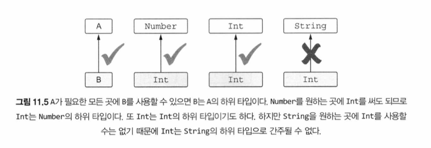
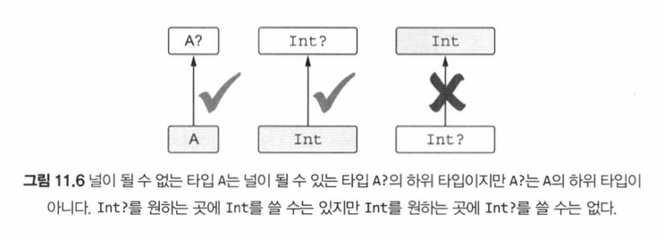
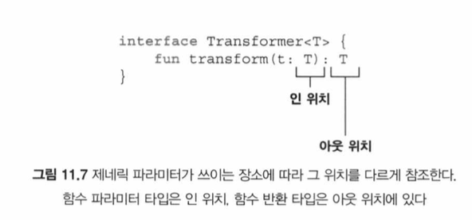
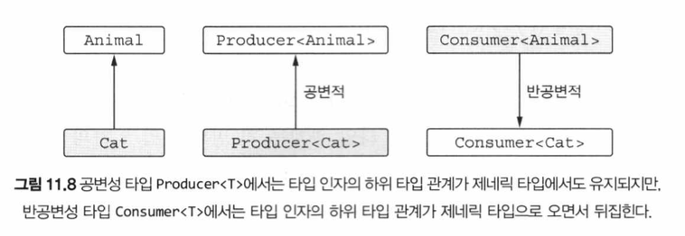
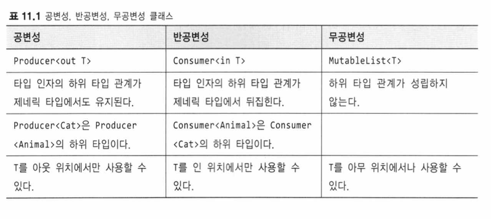
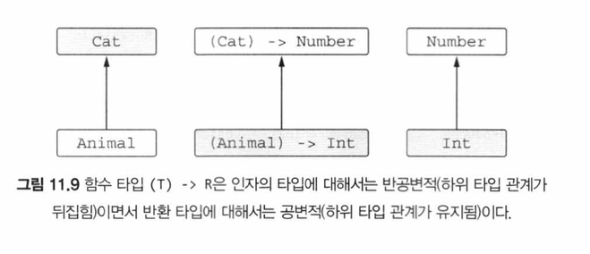

# 11장 - (p.469 - p.522)

## 타입 인자를 받는 타입 만들기: 제네릭 타입 파라미터

- 제네릭스를 사용하면 타입 파라미터를 받는 타입을 정의할 수 있음
- 제네릭 타입의 인스턴스가 만들어질 때는 타입 파라미터를 구체적인 타입 인자로 치환함
- 코틀린 컴파일러는 보통 타입과 마찬가지로, 타입 인자도 추론 가능
- 빈 리스트는 타입 인자를 추론할 근거가 없어 직접 타입 인자를 명시해야 함

### 제네릭 타입과 함께 동작하는 함수와 프로퍼티

- 컬렉션을 다루는 라이브러리 함수는 대부분 제네릭 함수

```kotlin
fun main() {
  val authors = listOf("Sveta", "Seb", "Roman", "Dima")
  val readers = mutableListOf<String>("Seb", "Hadi")
  println(readers.filter { it !in authors })
  // [Hadi]
}
```

- 람다 파라미터에 대해 자동으로 만들어진 변수 `it` 의 타입은 여기서 `String`

  - 컴파일러는 이를 추론 가능

- 클래스나 인터페이스 안에 정의된 메서드, 최상위 함수, 확장 함수에서 타입 파라미터를 선언할 수 있음

- 제네릭 함수를 정의할 때와 마찬가지인 구문으로 제네릭 확장 프로퍼티를 선언할 수 있음

```kotlin
val <T> List<T>.penultimate: T
  get() = this[size - 2]

fun main() {
  println(listOf(1, 2, 3, 4).penultimate)
  // 3
}
```

- 확장이 아닌 일반 프로퍼티는 타입 파라미터를 가질 수 없음

- 알고 계셨나요? `<>` 이 구문을 홑화살괄호 구문이라고 부른다는 사실

  - ㄴㅇㄱ

- 제네릭 클래스를 확장하는 클래스 (또는 제네릭 인터페이스를 구현하는 클래스) 를 정의하려면, 기반 타입의 제네릭 파라미터에 대해 타입 인자를 지정해야 함

  - 구체적인 타입을 넘길 수도 있고, 타입 파라미터로 받은 타입을 넘길 수도 있음

- 클래스가 자신을 타입 인자로 참조할 수도 있음
  - `Comparable` 인터페이스를 구현하는 클래스가 이런 패턴의 예
  - 비교 가능한 모든 값은 자신을 같은 타입의 다른 값과 비교하는 방법을 제공해야만 함

```kotlin
interface Comparable<T> {
  fun compareTo(other: T): Int
}

class String : Comparable<String> {
  override fun comapreTo(other: String): Int = TODO()
}
```

- `String` 클래스는 제네릭 `Comparable` 인터페이스를 구현하면서, 그 인터페이스의 타입 파라미터 `T` 로 `String` 자신을 지정

### 제네릭 클래스나 함수가 사용할 수 있는 타입 제한: 타입 파라미터 제약

- 타입 파라미터 제약 (type parameter constraint) 은 클래스나 함수에 사용할 수 있는 타입 인자를 제한하는 기능
- 어떤 타입을 제네릭 타입의 타입 파라미터에 대한 상계 (upper bound) 로 지정하면, 그 제네릭 타입을 인스턴스화할 때 사용하는 타입 인자는 반드시 그 상계 타입이거나 그 상계 타입의 하위 타입이어야 함
- 제약을 가하려면 타입 파라미터 이름 위에 콜론(`:`) 을 표시하고 그 뒤에 상계 타입을 적으면 됨
  - 자바에서는 `<T extends Number> T sum(List<T> list)` 처럼 `extends` 를 써서 같은 개념을 표현

```kotlin
fun <T : Number> List<T>.sum() : T
```

- 타입 파라미터 `T` 에 대한 상계를 정하고 나면, T 타입의 값을 그 상계 타입의 값으로 취급 가능
  - 상계 타입에 정의된 메서드를 `T` 타입 값에 대해 호출 가능

```kotlin
fun <T: Comparable<T>> max(first: T, second: T): T {
	return if (first > second) first else second
}

fun main() {
  println(max("kotlin", "java"))
	// kotlin
}
```

- `T` 가 `Comparable<T>` 를 구현하게 제약했으므로, 비교 가능한 `T` 타입의 객체만 사용할 수 있게 할 수 있음

- 타입 파라미터에 대해 둘 이상의 제약을 가해야 하는 경우

```kotlin
fun <T> ensureTrailingPeriod(seq: T)
		where T: CharSequence, T: Appendale {
	if (!seq.endsWIth('.')) { // CharSequence 인터페이스에 대해 정의된 확장 함수 호출
	  seq.append('.') // Appendable 인터페이스에 정의된 메서드 호출
  }
}

fun main() {
  val helloWorld = StringBuilder("Hello World")
  ensureTrailingPeriod(helloWorld)
  println(helloWorld)
  // Hello World.
}
```

### 명시적으로 타입 파라미터를 널이 될 수 없는 타입으로 표시해 널이 될 수 있는 타입 인자 제외시키기

- 항상 널이 될 수 없는 타입만 타입 인자로 받게 만들려면 타입 파라미터에 제약을 가해야 함
- `<T : Any>` 라는 제약은 `T` 타입이 항상 널이 될 수 없는 타입이 되도록 보장

- `Any` 뿐만 아니라, 다른 널이 될 수 없는 타입을 사용해 상계를 정해도 타입 파라미터가 널이 아닌 타입으로 제약됨

## 실행 시점 제네릭스 동작: 소거된 타입 파라미터와 실체화된 타입 파라미터

- JVM 의 제네릭스는 타입 소거 (type erasure) 을 사용해 구현됨
  - 실행 시점에 제네릭 클래스의 인스턴스에 타입 인자 정보가 들어있지 않다는 뜻
- 함수를 `inline` 으로 만들면 타입 인자가 지워지지 않게 할 수 있음
  - 코틀린에서는 이를 실체화 (`reified`) 됐다고 함

### 실행 시점에 제네릭 클래스의 타입 정보를 찾을 때 한계: 타입 검사와 캐스팅

- 자바처럼 코틀린 제네릭 타입 인자 정보는 런타임에 지워짐

- 타입 소거로 인해 생기는 한계
  - 타입 인자를 따로 저장하지 않기 때문에 실행 시점에 타입 인자를 검사할 수 없음
    - 예를 들어, 어떤 리스트가 문자열로 이뤄진 리스트인지, 다른 객체로 이뤄진 리스트인지를 실행 시점에 검사할 수 없음
    - 응 TypeScript 에서는 Typia 로 가능해~
  - 예를 들어, 사용자 입력에 따라 `List<String>` 이나 `List<Int>` 를 반환하는 `readNumbersOrWords` 라는 끔찍한 함수가 있다고 하면, is 검사를 통해 단어 리스트와 숫자 리스트를 구분하려는 시도는 컴파일되지 않음
  - 실행 시점에 어떤 값이 List 인지 여부는 확실히 알아낼 수 있지만, 그 리스트가 문자열, 사람 등 실제 어떤 타입의 원소가 들어있는 리스트인지는 알 수 없음. 그런 정보는 지워짐
    - 다만 저장해야 하는 타입 정보의 크기가 줄어들어 애플리케이션의 전체 메모리 사용량이 줄어든다는 제네릭 타입 소거 나름의 장점이 있음
- 그렇다면, 어떤 값이 집합이나 맵이 아니라 리스트라는 사실을 확인하려면? 스타 프로젝션 (star projection) 구문을 사용하면 됨

```kotlin
if (value is List<*>) { ... }
```

- 타입 파라미터가 2개 이상이라면, 모든 타입 파라미터에 \* 를 포함시켜야 함

- `as` 나 `as?` 캐스팅에도 여전히 제네릭 타입을 사용할 수 있음
  - 하지만 기저 클래스는 같지만 타입 인자가 다른 타입으로 캐스팅해도 여전히 캐스팅에 성공한다는 점을 조심해야 함
  - 실행 시점에는 제네릭 타입의 타입 인자를 알 수 없으므로 캐스팅은 항상 성공함
  - 그런 타입 캐스팅을 사용하면, 컴파일러가 unchecked cast (검사할 수 없는 캐스팅) 경고를 해줌

```kotlin
fun printSum(c: Collection<*>) {
	val intList = c as? List<Int>
		?: throw IllegalArgumentException("List is expected")
	println(intList.sum())
}
```

- 정수 리스트나 집합에 대해 `printSum` 을 호출하면 예상처럼 작동
  - 정수 리스트에 대해서는 합계를 출력하고 집합에 대해서는 `IllegalArgumentException` 이 발생
  - 하지만 잘못된 타입의 원소가 들어있는 리스트를 전달하면 실행 시점에 `ClassCastException` 이 발생
- 문자열 리스트를 `printSum` 함수에 전달하면, 어떤 값이 `List<Int>` 인지 검사할 수 없으므로 `IllegalArgumentException` 이 발생하지 않음

  - 따라서 `as?` 캐스트가 성공하고, 문자열 리스트에 대해 sum 함수가 호출됨
  - `sum` 이 실행되는 도중 예외가 발생
    - `sum` 은 `Number` 타입의 값을 리스트에서 가져와 서로 더하려고 시도
    - 하지만 `String` 을 `Number` 로 사용하려고 하면 실행 시점에 `ClassException` 이 발생

- 코틀린 컴파일러는 컴파일 시험에 타입 정보가 주어진 경우에는 is 검사를 수행하도록 허용

```kotlin
fun printSum(c: Collection<Int>) { // 컴파일 시점에 원소 타입이 알려져 있으므로
	when (c) {
		is List<Int> -> println("List sum: ${c.sum()}")
		is Set<Int> -> println("Set sum: ${c.sum()}")
	}
}

fun main() {
	printSum(listOf(1, 2, 3))
	// List sum: 6
	printSum(setOf(3, 4, 5))
	// Set sum: 12
}
```

### 실체화된 타입 파라미터를 사용하는 함수는 타입 인자를 실행 시점에 언급 가능

- 제네릭 타입 인자 정보는 실행 시점에 지워임
- 따라서 제네릭 클래스의 인스턴스가 있어도, 그 인스턴스를 만들 때 사용한 타입 인자를 알아낼 수 없음
- 그러므로 제네릭 함수가 호출되도, 그 함수의 본문에서는 호출 시 쓰인 타입 인자를 알 수 없음

- 하지만 인라인 함수를 사용하면 이런 제약을 피할 수 있음
- 어떤 함수에 `inline` 을 붙이면 컴파일러는 그 함수를 호출한 식을 모두 함수를 구현하는 코드로 바꿈

  - 함수가 람다를 인자로 사용하는 경우, 그 함수를 인라인 함수로 만들면 람다 코드도 함께 인라이닝되고, 그에 따라 익명 클래스와 객체가 생성되지 않아 성능이 더 좋아질 수 있음

- 실체화된 타입 파라미터를 사용하는 함수 정의

```kotlin
inline fun <reified T> isA(value: Any) = value is T

fun main() {
	println(isA<String>("abc"))
	// true
	println(isA<String>(123))
	// false
}
```

- 실체화된 타입 파라미터를 활용하는 가장 간단한 예제 중 하나는 표준 라이브러리 함수인 `filterIsInstance`
  - 이 함수는 인자로 받은 컬랙션에서 지정한 클래스의 인스턴스만을 모아 만든 리스트를 반환

```kotlin
fun main() {
	val items = listOf("one", 2, "three")
	println(items.filterIsInstance<String>())
	// [one, three]
}
```

- 문자열에만 관심이 있다면 이 함수의 타입 인자로 `String` 을 지정
  - 그 경우 이 함수의 반환 타입은 `List<String>`
  - 타입 인자를 실행 시점에 알 수 있고, `filterIsInstance` 는 그 타입 인자를 사용해 리스트의 원소 중에 타입이 일치하는 원소만 추려낼 수 있음

```kotlin
inline fun <reified T> // reified 키워드는 이 타입 파라미터가 실행 시점에 지워지지 않음을 표시
		Iterable<*>.filterIsInstance(): List<T> {
	val destination = mutalbeListOf<T>()
	for (elemetn in this) {
		if (element is T) { // 각 원소가 타입 인자로 지정한 클래스의 인스턴스인지 검사 가능
			destination.add(element)
		}
	}
	return destination
}
```

### 인라인 함수에서만 실체화된 타입 인자를 쓸 수 있는 이유

- 컴파일러는 인라인 함수의 본문을 구현한 바이트코드를 그 함수가 호출되는 모든 지점에 삽입함
- 컴파일러는 실체화된 타입 인자를 사용해 인라인 함수를 호출하는 각 부분의 정확한 타입 인자를 알 수 있음
- 따라서 컴파일러는 타입 인자로 쓰인 구체적인 클래스를 참조하는 바이트코드를 생성해 삽입 가능
- 결과적으로, `filterIsInstance<String>` 호출은 다음과 동등한 코드를 만들어냄

```kotlin
for (element in this) {
	if (element is String) {
		destination.add(element)
	}
}
```

- 만들어진 바이트코드는 타입 파라미터가 아니라 구체적인 타입을 사용하므로, 실행 시점에 벌어지는 타입 소거의 영향을 받지 않음
- 자바 코드에서는 `reified` 타입 파라미터를 사용하는 `inline` 함수를 호출할 수 없음

  - 자바에서는 코틀린 인라인 함수를 다른 보통 함수처럼 호출해, 인라인 함수를 호출해도 실제로 인라이닝이 되지는 않음
  - 실체화된 타입 파라미터가 있는 함수의 경우 타입 인자 값을 바이트코드에 넣기 위해 더 많은 작업이 필요함
  - 따라서 실체화된 타입 파라미터가 있는 인라이닝 함수를 일반 함수처럼 자바에서 호출 불가

- 함수의 파라미터 중에 함수 타입인 파라미터가 있고, 그 파라미터에 해당하는 인자 (람다) 를 함께 인라이닝하므로써 얻는 이익이 더 큰 경우에만 함수를 인라인 함수로 만들어야 함
- 하지만 이 경우에는, 함수를 `inline` 으로 만드는 이유가 성능 향상이 아니라 실체화된 타입 파라미터를 사용하기 위함
- 성능을 좋게 하려면 인라인 함수의 크기를 계속 관찰해야 함
  - 함수가 커지면 실체화된 타입에 의존하지 않는 부분을 별도의 일반 함수로 뽑아내는 것이 좋음

### 클래스 참조를 실체화된 파입 파라미터로 대신함으로써 java.lang.Class 파라미터 피하기

### 실체화된 타입 파라미터가 있는 접근가 정의

- 제네릭 타입에 대해 프로퍼티 접근자를 정의하는 경우, 프로퍼티를 `inline` 으로 표시하고 타입 파라미터를 `reified` 로 하면 타입 인자에 쓰인 구체적인 클래스를 참조할 수 있음

### 실체화된 타입 파라미터의 제약

- 실체화된 타입 파라미터에는 몇가지 제약이 있음
- 다음과 같은 경우, 실체화된 타입 파라미터를 사용할 수 있음
  - 타입 검사와 캐스팅 (`is`, `!is`, `as`, `as?`)
  - 코틀린 리플렉션 API (`::class`)
  - 코틀린 타입에 대응하는 `java.lang.Class` 를 얻기 (`::class.java`)
  - 다른 함수를 호출할 때 타입 인자로 사용
- 하지만 다음과 같은 일은 할 수 없음

  - 타입 파라미터 클래스의 인스턴스 생성하기
  - 타입 파라미터 클래스의 동반 객체 메서드 호출하기
  - 실체화된 타입 파라미터를 요구하는 함수를 호출하면서, 실체화하지 않은 타입 파라미터로 받은 타입을 타입 인자로 넘기기
  - 클래스, 프로퍼티, 인라인 함수가 아닌 함수의 타입 파라미터를 `reified` 로 지정하기

- 마지막 제약으로 인해 생기는 효과
  - 실체화된 타입 파라미터를 인라인 함수에만 사용할 수 있으므로, 실체화된 타입 파라미터를 사용하는 함수는 자신에게 전달되는 모든 람다를 인라이닝함
  - 인라이닝을 하고 싶지 않을 경우, `noinline` 변경자를 함수 타입 파라미터에 붙여 인라이닝을 금지시킬 수 있음

## 변성 (Variance) 은 제네릭과 타입 인자 사이의 하위 타입 관계를 기술

- 변성 개념은 `List<String>` 과 `List<Any>` 같이, 기저 타입이 같고 타입 인자가 다른 여러 타입이 서로 어떤 관계가 있는지 설명하는 개념
- 변성을 잘 활용하면 사용에 불편하지 않으면서 타입 안전성을 보장하는 API를 만들수 있음

### 변성은 인자를 함수에 넘겨도 안전한지 판단하게 해줌

- `String` 클래스는 `Any` 를 확장하므로, `Any` 타입 값을 파라미터로 받는 함수에 String 을 넘겨도 안전
  - 하지만 `Any` 와 `String` 이 `List` 인터페이스의 타입 인자로 들어갈 경우…
  - 어떤 함수가 리스트의 원소를 추가하거나 변경한다면 타입 불일치가 생길 수 있어 `List<Any>` 대신 `List<String>` 을 넘길 수 없음
    - 하지만 원소 추가나 변경이 없는 경우 안전
- 코틀린에서는 리스트의 변경 가능성에 따라 적절한 인터페이스를 선택하면 안정성을 제어 가능

### 클래스, 타입, 하위 타입 (subtype)

- 제네릭 클래스가 아닌 클래스에서는 클래스 이름을 바로 타입으로 사용 가능

  - `var x: String` 이라고 쓰면, `String` 클래스의 인스턴스를 저장하는 변수를 정의할 수 있음
  - `var x: String?` 처럼 같은 클래스 이름을 널이 될 수 있는 타입에도 쓸 수 있음
  - 모든 코틀린 클래스가 적어도 둘 이상의 타입을 구성할 수 있다는 뜻

- 타입 사이의 관계를 논의하려면 하위 타입에 대해 알아야 함
- 어떤 타입 A 의 값이 필요한 모든 장소에, 어떤 타입 B 의 값을 넣어도 아무 문제가 없다면 타입 B 는 타입 A 의 하위 타입

  - `Int` 는 `Number` 의 하위 타입
  - 모든 타입은 자신의 하위 타입

- 상위 타입 (supertype) 은 하위 타입의 반대
  - A 타입이 B 타입의 하위 타입이라면, B 는 A 의 상위 타입



- 한 타입 이 다른 타입의 하위 타입인지가 왜 중요할까?
- 컴파일러는 변수 대입이나 함수 인자 전달 시 하위 타입 검사를 매번 수행

```kotlin
fun test(i: Int) {
	val n: Number = i // Int 가 Number 의 하위 타입이어서 컴파일 됨

	fun f(s: String) { /* ... */ }
	f(i) // Int 가 String 의 하위 타입이 아니여서 컴파일되지 않음
}
```

- 어떤 값의 타입이 변수 타입의 하위 타입인 경우에만 값을 변수에 대입하도록 허용

- 간단한 경우, 하위 타입은 하위 클래스 (subclass) 와 근본적으로 같음

  - `Int` 클래스는 `Number` 의 하위 클래스이므로 `Int` 는 `Number` 의 하위 타입
  - `String` 은 `CharSequence` 의 하위 타입인 것처럼, 어떤 인터페이스를 구현하는 클래스의 타입은 그 인터페이스 타입의 하위 타입

- 널이 될 수 있는 타입은 하위 타입과 하위 클래스가 같지 않은 경우를 보여준 예

  

- 널이 될 수 없는 타입은 널이 될 수 있는 타입의 하위 타입

  - 하지만 두 타입 모두 같은 클래스에 해당함
  - 항상 널이 될 수 없는 타입의 값을 널이 될 수 있는 타입의 변수에 저장할 수 있지만, 거꾸로 널이 될 수 있는 타입의 값을 널이 될 수 없는 타입의 변수에 저장할 수는 없음
  - 이 때문에, 널이 될 수 없는 타입은 널이 될 수 있는 타입의 하위 타입이 됨

- 제네릭 타입을 이야기할 때 하위 클래스와 하위 타입의 차이가 더 중요해짐
- “`List<Any>` 를 파라미터로 받는 함수에 `List<String>` 타입의 값을 전달해도 괜찮은가?”
  - = “`List<String>` 은 `List<Any>` 의 하위 타입인가?”

### 무공변 (Invariant)

- 어떤 제네릭 타입 (예를 들어 `MutableList`) 에 대해 서로 다른 두 타입 A 와 B 에 대해 `MutableList<A>` 가 항상 `MutableList<B>` 의 하위 타입도 아니고 상위 타입도 아닌 경우에 이 제네릭 타입이 타입 파라미터에 대해 무공변 (invariant) 이라고 함
- 자바에서는 모든 클래스가 무공변

### 공변성은 하위 타입 관계를 유지한다

- 공변적인 클래스는 제네릭 클래스 (예: `Producer<T>`) 에 대해 A 가 B 의 하위 타입일 때 `Producer<A>` 가 `Producer<B>` 의 하위 타입인 경우를 말함
  - 이를 “하위 타입 관계를 유지한다” 고 함
  - 예를 들어, `Cat` 이 `Animal` 의 하위 타입이기 때문에, `Producer<Cat>` 은 `Producer<Animal>` 의 하위 타입임
- 코틀린에서 제네릭 클래스가 타입 파라미터에 대해 공변적임을 표시하려면 타입 파라미터 이름 앞에 out 을 넣어야 함

```kotlin
interface Producer<out T> {
	fun produce(): T
}
```

- 클래스의 타입 파라미터를 공변적으로 만들면, 함수 정의에 사용한 파라미터 타입과 타입 인자의 타입이 정확히 일치하지 않더라도 그 클래스의 인스턴스를 함수 인자나 반환값으로 사용할 수 있음

- 무공변 컬렉션 역할을 하는 클래스 정의
  - 예를 들어 `Herd` 클래스로 표현되는 동물 무리의 사육을 담당하는 함수가 있다고 하면
    - `Herd` 클래스의 타입 파라미터는 그 무리가 어떤 동물인지 알려줌

```kotlin
open class Animal {
	fun feed() { /* ... */ }
}

class Herd<T : Animal> { // 이 타입 파라미터를 공변으로 지정하지 않음
  val size: Int get() = /* ... */
  operator fun get(i: Int): T { /* ... */ }
}

fun feedAll(animals: Herd<Animal>) {
	for (i in 0..<animals.size) {
		animals[i].feed()
	}
}
```

```kotlin
class Cat: Animal() {
	fun cleanLitter() { /* ... */ }
}

fun takeCareOfCats(cats: Herd<Cat>) {
	for (i in 0 ..< cats.size) {
		cats[i].cleanLitter()
	}
	// feedAll(cats)
	// Error: inferred type is Herd<Cat>, but Herd<Animal> was expected
}
```

- `Herd` 클래스의 `T` 타입 파라미터에 대해 아무 변성도 지정하지 않았기 때문에, 고양이 무리는 동물 무리의 하위 클래스가 아님
- 명시적 타입 캐스팅을 사용하면 이 문제를 풀 수 있지만, 그런 식으로 처리하면 코드가 장황해지고 실수를 하기 쉬움

  - 타입 불일치를 해결하기 위해 강제 캐스팅을 하는 것은 결코 올바른 방법이 아님

- `Herd` 를 공변적인 클래스로 만들고 호출 코드를 바꿔서 해결할 수 있음

```kotlin
class Herd<out T : Animal> { // T 는 이제 공변적
  /* ... */
}

fun takeCareOfCats(cats: Herd<Cat>) {
	for (i in 0 ..< cats.size) {
		cats[i].cleanLitter()
	}
	feedAll(cats)
}
```

- 모든 클래스를 공변적으로 만들 수는 없음
  - 공변적으로 만들면 안전하지 못한 클래스도 있기 때문
  - 타입 파라미터를 공변적으로 지정하면, 클래스 내부에서 그 파라미터를 사용하는 방법을 제한함
  - 타입 안정성을 보장하기 위해 공변적 파라미터는 항상 아웃 (`out`) 위치에만 있어야 함
  - 이는 클래스가 `T` 타입의 값을 생산할 수는 있지만 소비할 수는 없다는 뜻
- 클래스 맴버를 선언할 때, 타입 파라미터를 사용할 수 있는 지점은 모두 인 (`in`) 과 아웃 위치로 나뉨
  - `T`라는 타입 파라미터를 선언하고 `T` 를 사용하는 함수가 멤버로 있는 클래스가 있다면
    - `T`가 함수의 반환 타입에 쓰인다면, `T`는 아웃 위치에 있음
      - 이 함수는 T 타입의 값을 생산
    - `T`가 함수의 파라미터 타입에 쓰인다면, `T` 는 인 위치에 있음
      - 이 함수는 `T` 타입의 값을 소비



- `Herd` 에서 타입 파라미터 `T` 를 사용하는 장소는 오직 `get` 메서드의 반환 타입 뿐

```kotlin
class Herd<out T: Animal> {
	val size: Int get() = /* ... */
	operator fun get(i: Int): T { /* ... */ } // T 를 반환 타입으로 사용
}
```

- 이 위치 (함수의 반환 타입) 은 아웃 위치

  - 따라서 이 클래스를 공변적으로 선언해도 안전
  - `Herd<Animal>` 의 `get` 을 호출하는 모든 코드는 `Cat` 이 `Animal` 의 하위 타입이기 때문에 전혀 문제없이 작동함

- 타입 파라미터 `T` 에 붙은 `out` 키워드는 다음 2가지를 함께 의미

  - 하위 타입 관계가 유지됨 (`Producer<Cat>` 은 `Producer<Animal>` 의 하위 타입)
  - `T` 를 아웃 위치에서만 사용할 수 있음

- `List<T>` 인터페이스
  - `List` 는 읽기 전용
  - 따라서 그 안에는 `T` 타입의 원소를 반환하는 `get` 메서드는 있지만 리스트에 `T` 타입의 값을 추가하거나 리스트에 있는 기존 값을 변경하는 메서드는 없음
  - 따라서, `List` 는 `T` 에 대해 공변적

```kotlin
interface List<out T> : Collection<T> {
	operator fun get(index: Int): T // 읽기 전용 메서드로 T 를 반환하는 메서드만 정의
																	// 따라서 T 는 '아웃' 위치에 쓰임
	// ...
}
```

- `MutableList<T>` 를 타입 파라미터 `T` 에 대해 공변적인 클래스로 선언할 수 없음

  - `MutableList<T>` 에는 `T` 를 인자로 받아 그 타입의 값을 반환하는 메서드가 있기 때문 (`T` 가 인과 아웃 위치에 동시에 쓰임)

- 생성자 파라미터는 인이나 아웃 위치 어느 쪽도 아님

  - 타입 파라미터가 `out` 이라 하더라도, 그 타입을 여전히 생성자 파라미터 선언에 사용 가능

- 변성은 코드에서 위험할 여지가 있는 메서드를 호출할 수 없게 만듦으로써 제네릭 타입의 인스턴스 역할을 하는 클래스 인스턴스를 잘못 사용하는 일이 없게 방지하는 역할을 함
  - 생성자는 (인스턴스를 생성한 뒤) 나중에 호출할 수 있는 메서드가 아니므로, 생성자는 위험할 여지가 없음
  - 하지만 val 이나 var 키워드를 생성자 파라미터에 적는다면 게터나 (변경 가능한 프로퍼티의 경우) 세터를 정의하는 것과 같음
    - 따라서 읽기 전용 프로퍼티는 아웃 위치, 변경 가능 프로퍼티는 아웃과 인 위치 모두에 해당
    ```kotlin
    class Herd<T: Animal>(var leadAnimal: T, vararg animals: T) { /* ... */ }
    ```
  - 여기서는 `T` 타입인 `leadAnimal` 프로퍼티가 인 위치에 있기 때문에 `T` 를 `out` 으로 표시할 수 없음
  - 또한 이런 규칙은 오직 외부에서 볼 수 있는 (`public`, `protected`, `internal`) 클래스 API 에만 적용할 수 있음
  - 비공개 (`private`) 메서드의 파라미터는 인도 아니고 아웃도 아닌 위치
  - 변성 규칙은 클래스 외부의 사용자가 클래스를 잘못 사용하는 일을 막기 위한 것이므로, 클래스 내부 구현에는 적용되지 않음

### 반공변성 (contravariance) 은 하위 타입 관계를 뒤집는다

- 반공변 클래스의 하위 타입 관계는 그 클래스의 타입 파라미터의 상하위 타입 관계와 반대
- 예를들어 `Comparator` 인터페이스에는 `compare`라는 메서드가 있음
  - 이 메서드는 주어진 두 객체를 비교함

```kotlin
interface Comparator<in T> {
	fun compare(e1: T, e2: T): Int { /* ... */ } // T 를 인 위치에 사용
}
```

- 위 인터페이스는 `T` 타입의 값을 소비하기만 함

  - 따라서 `T` 앞에는 `in` 키워드를 붙여야만 함

- 어떤 클래스에 대해 (예를 들어 `Consumer<T>`), 타입 B 가 타입 A 의 하위 타입일 때 `Consumer<A>` 가 `Consumer<B>` 의 하위 타입인 관계가 성립하면 제네릭 클래스는 타입 인자 T 에 대해 반공변임
  - 여기서 A 와 B 의 위치가 서로 뒤바뀐다는 점에 유의
    - 따라서 하위 타입 관계가 뒤집힌다고 말함
    - 예를 들어, `Consumer<Animal>` 은 `Consumer<Cat>` 의 하위 타입



- `in` 이라는 키워드는 그 키워드가 붙은 타입이 이 클래스의 메서드 안으로 전달돼 메서드에 의해 소비된다는 뜻
- 공변성의 경우와 마찬가지로, 타입 파라미터의 사용을 제한함으로써 특정 하위 타입 관계에 도달할 수 있음

  

- 클래스나 인터페이스가 어떤 타입 파라미터에 대해서는 공변적이면서, 다른 타입 파라미터에 대해서는 반공변적일 수도 있음

```kotlin
interface Function1<in P, out R> {
	operator fun invoke(p: P) : R
}
```

- 이는 함수 `Function1` 의 하위 타입 관계는 첫 번째 타입 인자의 하위 타입 관계와는 반대지만, 두 번째 타입 인자의 하위 타입 관계와는 같음을 의미

- 예를 들어, 동물을 인자로 받아 정수를 반환하는 람다를 고양이에게 번호를 붙이는 고차 함수에 넘길 수 있음

```kotlin
fun enumerateCats(f: (Cat) -> Number) { /* ... */ }
fun Animal.getIndex(): Int = /* ... */

fun main() {
	enumerateCats(Animal::getIndex) // Animal 은 Cat 의 상위 타입이며 Int 는 Number 의
																	// 하위 타입이므로, 이 코드는 올바른 코드
}
```



### 사용 지점 변성을 사용해 타입이 언급되는 지점에서 변성 지정

- 클래스를 선언하면서 변성을 지정하면, 그 클래스를 사용하는 모든 장소에 변성 지정자가 영향을 끼침
- 이런 방식을 선언 지점 변성 (declaration site variance) 이라 부름

- 자바에서는 타입 파라미터가 있는 타입을 사용할 때마다 그 타입 파라미터를 하위 타입이나 상위 타입 중 어떤 타입으로 대치할 수 있는지 명시해야 함
- 이런 방식을 사용 지점 변성 (use-site variance) 이라 부름

- `MutableList` 와 같은 상당수의 인터페이스는 타입 파라미터로 지정된 타입을 소비하는 동시에 생산할 수 있기 때문에 일반적으로 공변적이지도, 반공변적이지도 않음

```kotlin
fun <T: R, R> copyData(source: MutableList<T>, // 원본의 원소 타입은 대상 원소 타입의
																							 // 하위 타입이어야만 함
												destination: MutableList<R>) {
	for (item in source) {
		destination.add(item)
	}
}
```

- 함수 구현이 아웃 위치 (또는 인 위치) 에 있는 타입 파라미터를 사용하는 메서드만 호출한다면, 함수를 정의할 때 그 정보를 바탕으로 타입 파라미터에 변성 변경자를 추가할 수 있음

```kotlin
fun <T> copyData(source: MutableList<out T>, // out 키워드를 타입을 사용하는 위치 앞에
																						 // 붙이면 T 타입을 in 위치에 사용하는
																						 // 메서드를 호출하지 않는다는 뜻
												destination: MutableList<T>) {
	for (item in source) {
		destination.add(item)
	}
}
```

- 타입 선언에서 타입 파라미터를 사용하는 위치라면 어디에나 변성 변경자를 붙일 수 있음
  - 파라미터 타입, 로컬 변수 타입, 함수 반환 타입 등에 타입 파라미터가 쓰이는 경우, `in` 이나 `out` 변경자를 붙일 수 있음
  - 이때 타입 프로젝션 (type projection) 이 일어남
  - 즉, `source` 를 일반적인 `MutableList` 가 아니라, `MutableList` 를 프로젝션한 (제약을 가한) 타입으로 만듬
  - 이 경우 `copyData` 함수는 `MutableList` 의 메서드 중에서 반환 타입으로 타입 파라미터 `T` 를 사용하는 메서드만 호출할 수 있음
    - 더 정확하게는, 타입 파라미터 `T` 를 아웃 위치에서만 사용 가능

### 스타 프로젝션: 제네릭 타입 인자에 대한 정보가 없음을 표현하고자 \* 사용

- `MutableList<*>` 는 `MutableList<Any?>` 와 같지 않음
  - 여기서 `MutableList<T>` 가 `T` 에 대해 무공변성이라는 점이 중요
- `MutableList<Any?>` 는 모든 타입의 원소를 담을 수 있음을 알 수 있는 리스트
- 반면 `MutableList<*>` 는 어떤 정해진 구체적인 타입의 원소만을 담는 리스트지만, 그 원소의 타입을 정확히 모른다는 사실을 표현
  - 원소 타입을 모른다고 해서 그 안에 아무 원소나 다 담아도 된다는 뜻은 아님
  - `MutableList<*>` 타입의 리스트에서 원소를 얻을 수 있음
    - 그런 경우 진짜 원소 타입은 알 수 없지만 어쨌든 그 원소 타입이 `Any?` 의 하위 타입이라는 사실은 분명함

```kotlin
import kotlin.random.Random

fun main() {
	val list: MutableList<Any?> = mutableListOf('a', 1, "QWER")
	val chars = mutableListOf('a', 'b', 'c')
	val unknownElements: MutableList<*> =if (Random.nextBoolean()) list else chars
	println(unknownElements.first()) // 원소를 가져와도 안전. first() 는 Any? 타입의 원소를 반환
	// a
	unknownElements.add(42) // 컴파일러는 이 메서드 호출을 금지함
	// Error: Out-projected type 'MutableList<*>' prohibits
	// the use of 'fun add(element: E): Boolean'
}
```

- 왜 컴파일러가 `MutableList<*>` 를 아웃 프로젝션 타입으로 인식할까?

  - 이 맥락에서, `MutableList<*>` 는 `MutableList<out Any?>` 처럼 프로젝션된다 (동작한다)
  - 어떤 리스트의 원소 타입을 모르더라도 그 리스트에서 안전하게 `Any?` 타입의 원소를 꺼내올 수는 있지만 (`Any?` 는 모든 코틀린 타입의 상위 타입), 타입을 모르는 리스트에 원소를 마음대로 넣을 수는 없음

- 타입 인자에 대한 정보가 중요하지 않을 때 스타 프로젝션을 사용
- 즉, 타입 파라미터를 시그니처에서 전혀 언급하지 않거나 데이터를 읽기는 하지만 구체적인 타입은 신경쓰지 않을 때 스타 프로젝션을 사용

### 타입 별명

- 여러 제네릭 타입을 조합한 타입을 다룰 때, 타입 시그니처의 모든 의미를 추적하기 귀찮을 수 있음
- 이런 경우 코틀린은 타입 별명 (type alias) 을 사용할 수 있게 해줌

```kotlin
typealias NameCombiner (String, String, String, String) -> String

val authorsCombiner: NameCombiner = { a, b, c, d -> "$a et al." }
val bandCombiner: NameCombiner = { a, b, c, d -> "$a, $b & The Gang" }

fun combineAuthors(combiner: NameCombiner) {
	println(combiner("Sveta", "Seb", "Dima", "Roman"))
}

fun main() {
	combineAuthors(bandCombiner)
	// Sveta, Seb & The Gang
	combineAuthors { a, b, c, d, -> "$d, $c, & Co." }
	// Roman, Dima & Co
}
```

- 타입 별명을 도입하면 코드를 읽을 때 좀 더 쉽게 이해가 되도록 함수형 타입에 새로운 맥락을 부여할 수 있음

## 요약

- 코틀린 제네릭스는 자바와 비슷
- 자바처럼 제네릭 타입의 타입 인자는 컴파일 시점에만 존재
- 타입 인자가 실행 시점에 지워지므로 타입 인자가 있는 타입 (제네릭 타입) 을 `is` 연산자로 검사 불가
- 인라인 함수의 타입 파라미터를 `reified` 로 표시해서 실체화하면, 실행 시점에 그 타입을 `is` 로 검사하거나 `java.lang.Class` 인스턴스를 얻을 수 있음
- 변성은 기저 클래스가 같고 타입 파라미터가 다른 두 제네릭 타입 사이의 상하위 타입 관계가 타입 인자 사이의 상하위 타입 관계에 의해 어떤 영향을 받는지 명시하는 방법
- 제네릭 클래스의 타입 파라미터가 아웃 위치에서만 사용되는 경우 (생산자), 그 타입 파라미터를 `out` 으로 표시해서 공변적으로 만들 수 있음
- 공변성의 반대는 반공변성
  - 제네릭 클래스의 타입 파라미터가 인 위치에서만 사용되는 경우 (소비자), 그 타입 파라미터를 `in` 으로 표시해서 반공변적으로 만들 수 있다
- 코틀린의 읽기 전용 `List` 인터페이스는 공변적
  - 따라서 `List<String>` 은 `List<Any>` 의 하위 타입
- 함수 인터페이스는 첫 번째 타입 파라미터에 대해서는 반공변적이고, 두 번째 타입 파라미터에 대해서는 공변적
  - 따라서 (`Animal`) → `Int` 는 (`Cat`) → `Number` 의 하위 타입
- 코틀린에서는 제네릭 클래스의 공변성을 전체적으로 지정하거나 (선언 지점 변성) 구체적인 사용 위치에서 지정할 수 있음 (사용 지점 변성)
- 제네릭 클래스의 타입 인자가 어떤 타입인지 정확히 모르거나, 타입 인자가 어떤 타입인지가 중요하지 않을 때 스타 프로젝션 구문을 사용 가능
- 타입 별명을 사용하면 타입에 대해 더 짧은 이름이나 다른 이름을 부여할 수 있음
  - 타입 별명은 컴파일 시점에 원래의 타입으로 치환됨

## 문제

### 문제 1

- 아래 문장 중 컴파일이 성공하는 문장들은 몇 번일까요?

```kotlin
class Fruit
class Apple : Fruit()
class Box<T>(val t: T)

// 1
val a1: Box<out Fruit> = Box(Apple())
// 2
val a2: Box<Fruit> = Box(Apple())
// 3
val a3: Box<in Fruit> = Box(Apple())
// 4
val a4: Box<Apple> = Box<Fruit>(Fruit())
```

### 문제 2

- 아래 코드는 정상적으로 작동할까요?

```kotlin
val anyComparator: Comparator<Any?> = Comparator { a, b -> a.hashCode() - b.hashCode() }

val words = mutableListOf("foo", "bar")

words.sortWith(anyComparator)
```
