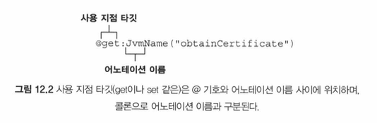
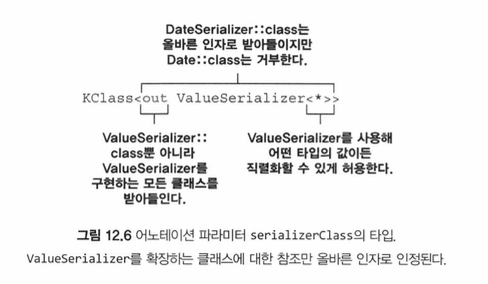
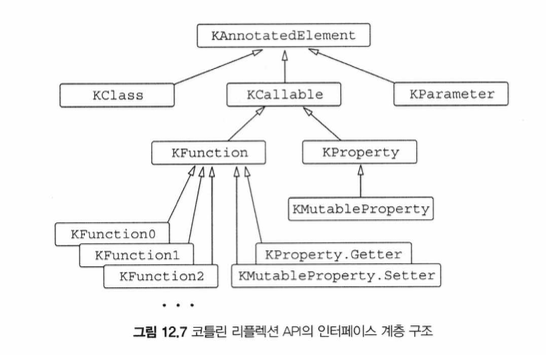
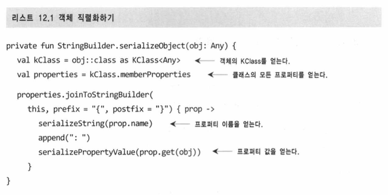
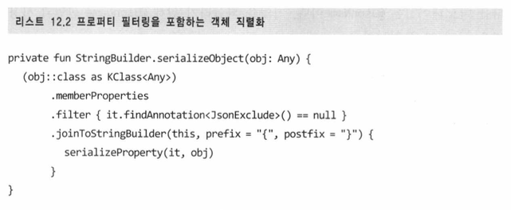
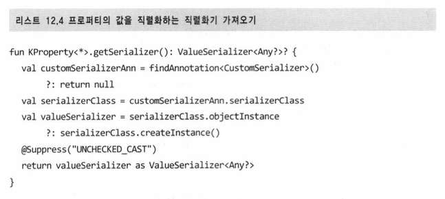
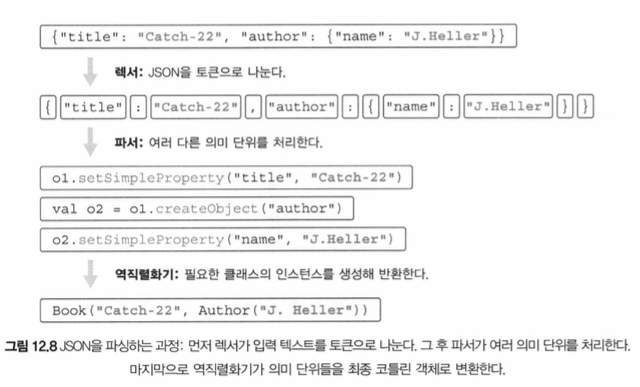

# 12장 - (p.525 - p.568)

- 어떤 함수를 호출하려면 그 함수가 정의된 클래스의 이름과 함수 이름, 파라미터 등을 알아야 함
- 하지만 어노테이션 (annotation) 과 리플렉션 (reflection) 을 사용하면 그런 제약을 벗어나 미리 알지 못하는 임의의 클래스를 다룰 수 있음
- 어노테이션을 사용하면 라이브러리가 요구하는 의미를 클래스에 부여할 수 있음
- 리플렉션을 사용하면 실행 시점에 컴파일러 내부 구조를 분석할 수 있음

## 어노테이션 선언과 적용

- 어노테이션을 사용하면 선언에 추가적인 메타데이터를 연관시킬 수 있음
- 이후 어노테이션이 설정된 방식에 따라 메타데이터를 소스코드, 컴파일된 클래스 파일, 런타임에 대해 작동하는 도구를 통해 접근할 수 있음

### 어노테이션을 적용해 선언에 표지 남기기

```kotlin
import kotlin.test.*

class MyTest {
	@Test // @Test 어노테이션을 통해 제이유닛 프레임워크에게 이 메서드를 테스트로 호출하라고 지시
	fun testTrue() {
		assertTrue(1 + 1 == 2)
	}
}
```

- 어노테이션의 인자로는 기본 타입의 값, 문자열, 이넘, 클래스 참조, 다른 어노테이션 클래스 그리고 지금까지 말한 요소들로 이뤄진 배열이 쓰일 수 있음
  - 어노테이션 인자를 지정하는 문법은 자바와 약간 다름
  1. 클래스를 어노테이션 인자로 지정: @MyAnnotation(MyClass::class)
  2. 다른 어노테이션을 인자로 지정: 이때는 다른 어노테이션의 이름 앞에 @를 넣지 않음
  3. 배열을 인자로 지정: @RequestMapping(path [”/foo”, “/bar”]) 처럼 각괄호를 사용
     1. 배열을 지정하기 위해 arrayOf 함수를 사용할 수도 있음
- 어노테이션 인자를 컴파일 시점에 알 수 있어야 하므로, 임의의 프로퍼티를 인자로 지정할 수는 없음
  - 프로퍼티를 어노테이션 인자로 사용하려면 그 앞에 const 변경자를 붙여야 함
  - 컴파일러는 const 가 붙은 프로퍼티를 컴파일 시점 상수로 취급

### 어노테이션이 참조할 수 있는 정확한 선언 지정: 어노테이션 타깃

- 사용 시점 타깃 (use-site target) 선언을 통해 어노테이션을 붙일 요소를 정할 수 있음



- 사용 지점 타깃을 지정할 때 지원하는 타깃 목록은 다음과 같음:
  - property: 프로퍼티 전체 (자바에서 선언된 어노테이션에는 이 사용 지점 타깃을 지정할 수 없음)
  - field: 프로퍼티에 의해 생성되는 필드
  - get: 프로퍼티 게터
  - set: 프로퍼티 세터
  - receiver: 확장 함수나 프로퍼티의 수신 객체 파라미터
  - param: 생성자 파라미터
  - setparam: 세터 파라미터
  - delegate: 위임 프로퍼티의 위임 인스턴스를 담아둔 필드
  - file: 파일 안에 선언된 최상위 함수와 프로퍼티를 담아두는 클래스
- 가장 흔히 쓰이는 예:
  - 어노테이션이 붙은 식의 문맥에서 컴파일러 경고를 무시하기 위한 @Suppress 어노테이션
  ```kotlin
  fun test(list: List<*>) {
  	@Suppress("UNCHECKED_CAST")
  	val strings = list as List<String>
  	// ...
  }
  ```
  - 마치 TypeScript 의 @ts-nocheck

### 어노테이션을 활용해 JSON 직렬화 제어 (JKid 라이브러리)

- (JKid 라이브러리 내에서) 어노테이션을 활용해 객체를 직렬화하거나 역직렬화하는 방법을 제어할 수 있음

### 어노테이션 선언

```kotlin
annotation class JsonExclude
```

- 어노테이션 클래스는 선언이나 식과 관련 있는 메타데이터의 구조만 정의하기 때문에, 내부에 아무 코드도 들어있을 수 없음
  - 그러므로, 컴파일러는 어노테이션 클래스에서 본문을 정의하지 못하게 막음

```kotlin
annoataion class JsonName(val name: String)
```

- 파라미터가 있는 어노테이션을 정의하려면, 어노테이션 클래스의 주 생성자에 파라미터를 선언해야 함
  - 일반적인 주 생성자 구문을 사용하면서, 모든 파라미터를 val 로 선언함
    - 어노테이션 클래스의 경우, 반드시 모든 파라미터가 val 이어야 함

### 메타어노테이션: 어노테이션을 처리하는 방법 제어

- 메타어노테이션 (meta-annotation): 어노테이션 클래스에 적용할 수 있는 어노테이션
- 표준 라이브러리에서 가장 흔히 쓰이는 메타어노테이션은 @Target
  - JKid 의 JsonExclude 와 JsonName 어노테이션도 적용 가능한 타깃을 지정하기 위해 @Target 을 사용
  ```kotlin
  @Target(AnnotationTarget.PROPERTY)
  annotation class JsonExclude
  ```
- @Target 메타어노테이션은 어노테이션을 적용할 수 있는 요소의 유형을 지정
- 어노테이션 클래스에 대해 구체적인 @Target 을 지정하지 않으면, 모든 선언에 적용할 수 있는 어노테이션이 됨
- 메타어노테이션을 직접 만들어야 한다면 ANNOTATION_CLASS 를 타깃으로 지정
- 대상을 PROPERTY 로 지정한 어노테이션을 자바 코드에서 사용할 수는 없음
  - 자바에서 그런 어노테이션을 사용하려면 AnnotationTarget.FIELD 를 두 번쨰 타깃으로 추가해야 함

### 어노테이션 파라미터로 클래스 사용

- 인터페이스의 인스턴스를 직접 만들 수 없으므로, 역직렬화 시 어떤 클래스를 사용해 인터페이스를 구현할지를 지정할 수 있어야 함

```kotlin
interface Company {
	val name: String
}

data class CompanyImpl(override val name: String) : Company

data class Person(
	val name: String,
	@DeserializeInterface(CompanyImpl::class) val company: Company
)
```

- 역직렬화 과정에서 company 프로퍼티를 표현하는 JSON 을 읽으면, JKid 는 그 프로퍼티 값에 해당하는 JSON 을 역직렬화하면서 CompanyImpl 의 인스턴스를 만들어 Person 인스턴스의 company 프로퍼티에 설정함

```kotlin
annotation class DeserializeInterface(val targetClass: KClass<out Any>)
```

- 클래스 참조를 인자로 받는 어노테이션 정의

- KClass 타입은 코틀린 클래스에 대한 참조를 저장
  - CompanyImpl::class 의 타입은 KClass<CompanyImpl>
    - 이 타입은 DeserializeInterface 의 파라미터 타입인 KClass<out Any> 의 하위 타입

### 어노테이션 파라미터로 제네릭 클래스 받기

- 기본적으로 제이키드는 기본 타입이 아닌 프로퍼티를 내포된 객체로 직렬화함
- 이런 기본 동작을 변경하고 싶으면 값을 직렬화하는 로직을 직접 제공하면 됨

```kotlin
interface ValueSerializer<T> {
	fun toJsonValue(value: T): Any?
	fun fromJsonValue(jsonValue: Any?): T
}
```

- ValueSerializer<Date> 를 구현하는 DateSerializer 를 만들었을 때, 해당 로직을 아래처럼 Person 클래스에 적용 가능

```kotlin
data class Person(
	val name: String,
	@CustomSerializer(DateSerializer::class) val birthDate: Date
)
```

- 이제 @CustomSesralizer 어노테이션을 구현해야 함.

  - ValueSerializer 클래스는 제네릭 클래스이므로 타입 파라미터가 있음
  - 따라서 ValueSerializer 타입을 참조하려면 항상 타입 인자를 제공해야 함
  - 하지만 이 어노테이션이 어떤 타입에 대해 쓰일지 알 수 없으므로, 여기서는 스타 프로젝션을 인자로 사용할 수 있음

  ```kotlin
  annotation class CustomSerializer(
  	val serializerClass: KClass<out ValueSerializer<*>>
  )
  ```

  

- 여기서 위 어노테이션이 ValueSerializer 인터페이스를 구현하는 클래스만 인자로 받아야 함을 명시할 필요가 있음
- e.g.) Date 가 ValueSerializer 을 구현하지 않으므로, @CustomSerializer(Date::class) 라는 어노테이션은 금지시켜야 함

## 리플렉션: 실행 시점에 코틀린 객체 내부 관찰

- 리플렉션을 사용하면 어노테이션에 저장된 데이터에 접근 가능
- 리플렉션은 실행 시점에 (동적으로) 객체의 프로퍼티와 메서드에 접근할 수 있게 해주는 방법

- 보통 객체의 메서드나 프로퍼티에 접근할 때는 프로그램 소스코드 안에 구체적인 선언이 있는 메서드나 프로퍼티 이름을 사용하며, 컴파일러는 그런 이름이 실제로 가리키는 선언을 정적으로 (컴파일 시점에) 찾아내 해당하는 선언이 실제 존재함을 보장
- 하지만, 타입과 관계없이 객체를 다뤄야 하거나, 객체가 제공하는 메서드나 프로퍼티 이름을 오직 실행 시점에만 알 수 있는 경우가 있음
  - e.g) 직렬화 라이브러리
    - 직렬화 라이브러리는 어떤 객체는 JSON 으로 변환할 수 있어야 하기 때문에, 특정 클래스나 프로퍼티만 참조할 수 없음. 이때 리플렉션을 사용.

### 코틀린 리플렉션 API: KClass, KCallable, KFunction, KProperty

- KClass 를 사용하면 클래스 안에 있는 모든 선언을 나열하고, 각 선언에 접근하거나, 클래스의 상위 클래스를 얻는 등의 작업이 가능
- MyClass::class 라는 식으로 KClass 의 인스턴스를 얻을 수 있음
  - myObject 라는 객체의 클래스를 실행 시점에 얻으려면, myObject::class 를 사용하면 됨

```kotlin
interface KClass<T: Any> {
	val simpleName: String?
	val qualifiedName: String?
	val members: Collection<KCallable<*>>
	val constructors: Collection<KFunction<T>>
	val nestedClasses: Collection<KClass<*>>
	// ...
}
```

- KCallable 은 함수와 프로퍼티를 아우르는 공통 상위 인터페이스
  - 안에 call 메서드가 있음
  - call 을 사용하면, 함수나 프로퍼티의 게터를 호출할 수 있음
  - call 을 사용할 때는 함수 인자를 vararg 리스트로 전달
- KFuncion1 은 이 함수의 파라미터가 1개라는 뜻
- call 메서드는 모든 타입의 함수에 적용할 수 있는 일반적인 메서드지만, 타입 안정성을 보장해주지는 않음

- KProperty 의 call 메서드는 프로퍼티의 게터를 호출



### 리플렉션을 사용해 객체 직렬화 구현

```kotlin
fun serialize(obj: Any): String
```

- 위 함수는 객체를 받아 그 객체에 대한 JSON 표현을 문자열로 돌려줌
  - 이 append 호출을 더 간결하게 수행하기 위해, 직렬화 기능을 StringBuilder 의 확장 함수로 구현
  - 이렇게 하면 별도로 수신 객체를 지정하지 않고 append 메서드를 편하게 사용 가능
  ```kotlin
  private fun StringBuilder.serializeObject(x: Any) {
  	append(/* ... */)
  }
  ```
  - 함수 파라미터를 확장 함수의 수신 객체로 바꾸는 방식은 코틀린 코드에서 흔히 사용하는 패턴
  - serialize는 대부분의 작업을 serializeObject 에 위임



### 어노테이션을 활용해 직렬화 제어

- serializeObject 에서 어노테이션을 처리하는 방법

- @JsonExclude

```kotlin
val peroperties = kClass.memberProperties.filter { it.findAnnotation<JsonExclude>() == null }
```

- @JsonName

```kotlin
val jsonNameAnn = prop.findAnnotation<JsonName>()
	// @JsonName 어노테이션이 있으면 해당 인스턴스를 얻음
val propName = jsonNameAnn?.name ?: prop.name
	// 어노테이션에서 name 인자를 찾고, 그런 인자가 없으면 prop.name 을 사용
```

- 최종 진화



- @CustomSerializer



### JSON 파싱과 객체 역직렬화

- 역직렬화를 올바르게 수행하려면, 실행 시점에 타입 파라미터에 접근해야 함
  - 이는 타입 파라미터에 reified 를 붙여야 한다는 뜻
    - 그로 인해 inline 으로 선언해야 함

```kotlin
inline fun <reified T: Any> deserialize(json: String): T
```

- 갑자기 분위기 컴파일러 이론수업 (렉서 + 파서)



### 최종 역직렬화 단계: callBy() 와 리플렉션을 사용해 객체 만들기

- ClassInfo 클래스
  - 최종 객체 인스턴스를 생성하고, 생성자 파라미터 정보를 캐시
- ClassInfoCache 는 리플렉션 연산의 비용을 줄이기 위한 클래스
  - 클래스별로 한 번만 연산을 수행하고 검색 결과를 캐시에 넣어 사용

## 요약

- 코틀린에서 어노테이션을 적용할 때는 @MyAnnotation(parms) 구문을 사용
- 코틀린에서는 파일과 식 등, 얿은 범위에 타깃에 대해 어노테이션을 붙일 수 있음
- 어노테이션 인자로 기본 타입 값, 문자열, 이넘, 클래스 참조, 다른 어노테이션 클래스의 인스턴스, 배열을 사용할 수 있음
- @get:JvmName 에서처럼 어노테이션의 사용 지점 타깃을 명시하면, 하나의 코틀린 선언이 여러 가지 바이트코드 요소를 만들어내는 경우, 정확히 어떤 부분에 어노테이션을 적용할지 지정할 수 있음
- 어노테이션 클래스를 정의할 때는 annotation class로 시작함
  - 이 클래스는 모든 파라미터를 val 프로퍼티로 표시한 주 생성자가 있어야 하고, 본문은 없어야 함
- 메타어노테이션을 사용해 타깃, 어노테이션 유지 모드 둥 여러 어노테이션 특성을 지정할 수 있음
- 리플렉션 API를 통해 실행 시점에 객쳬의 메서드와 프로퍼티를 동적으로 열거하고 접근할 수 있음
  - 리플렉션 API에는 클래스 (KClass), 함수 (KFunction) 등, 여러 종류의 선언을 표현하는 인터페이스가 들어있음
- 클래스의 경우 KClass 인스턴스를 얻기 위해 ClassName::class를 사용
  - 객체로부터 KClass 인스턴스를 얻으려면 objName::class 를 사용
- KFunction과 KProperty 인터페이스는 모두 KCallable을 확장
  - KCallable 은 제네릭 call 메서드를 제공
- KCallable.callBy 메서드를 사용하면 메서드를 호출하면서 디폴트 파라미
  터 값을 사용할 수 있음
- KFunction0, KFunction1 등의 인터페이스는 모두 파라미터 개수가 다른 함수를 표현하며, invoke 메서드를 사용해 함수를 호출할 수 있음
- KProperty0, KProperty1은 수신 객쳬의 개수가 다른 프로퍼티들을 표현하며, 값을 얻기 위한 get 메서드를 지원
  - KMutableProperty0 과 KMutableProperty1 은 각각 KProperty0 과 KProperty1 을 확장하며, set 메서드를 통해 프로퍼티 값을 변경할 수 있음
- KType의 실행 시점 표현을 얻기 위해 typeOf<T>() 함수를 사용
