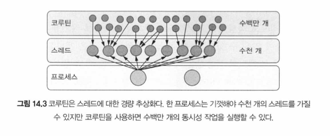
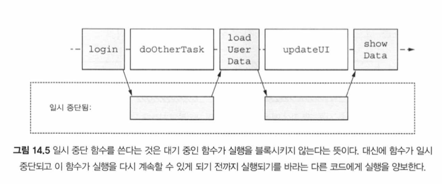
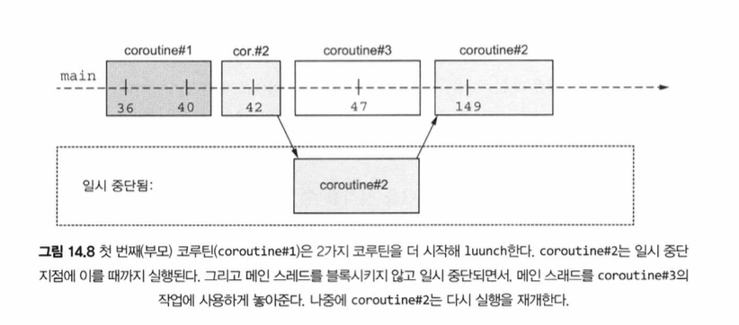
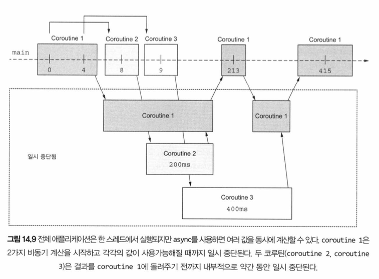
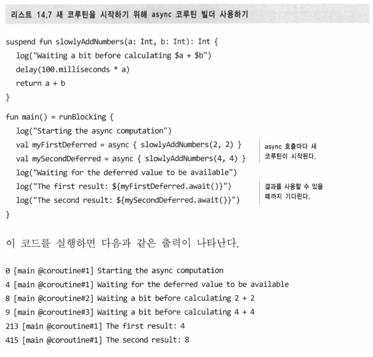
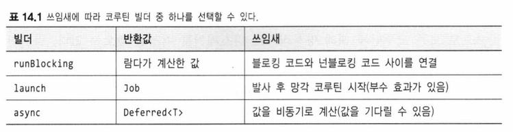
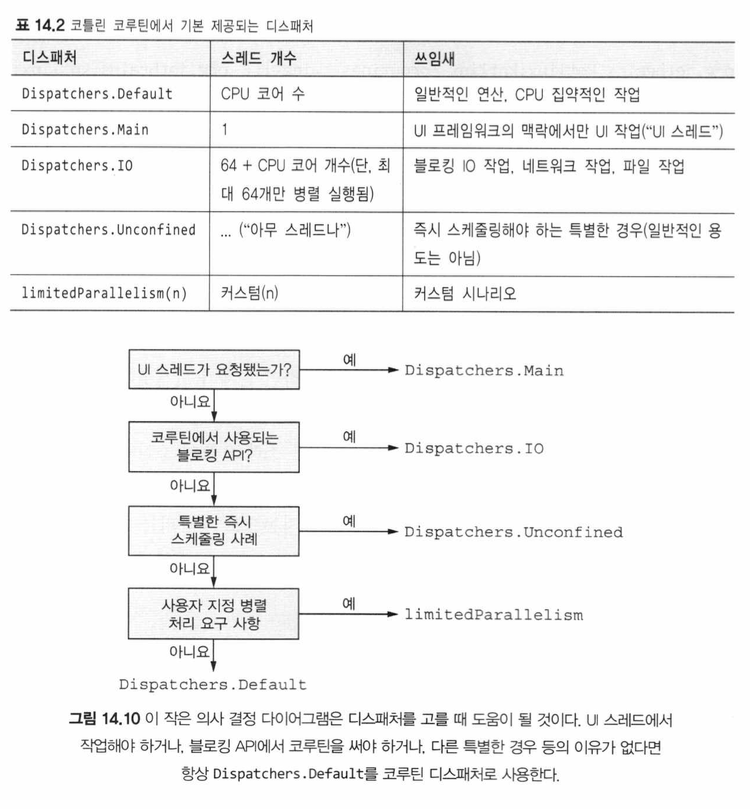
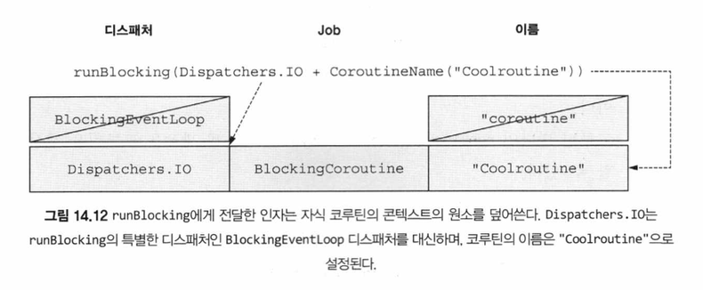

# 14장 - (p.615 - 648)

## 동시성과 병렬성

- 동시성: 여러 작업을 동시에 실행하는 것
  - 코드를 여러 부분으로 나눠서 동시에 수행할 수 있는 능력
- 병렬성: 여러 작업을 여러 CPU 코어에서 물리적으로 동시에 실행하는 것
- 코틀린 코루틴을 사용하면 동시성 계산과 병렬성 계산을 모두 할 수 있음

## 일시 중단 함수와 코루틴

- 코루틴은 코틀린의 강력한 특징으로
  - 비동기적으로 실행되는 넌블로킹 동시성 코드를 우아하게 작성할 수 있게 해줌
  - 스레드와 같은 전통적 방법과 비교하면 코루틴이 훨씬 더 가볍게 작동함
  - 구조화된 동시성을 통해 코루틴은 동시성 작업과 그 생명주기를 관리할 수 있는 기능도 제공함
- 일시 중단 함수는 스레드를 블록시키는 단점이 없이 순차적 코드처럼 보이는 동시성 코드를 작성할 수 있게 해줌
- 스레드는 기본적으로 독립적인 프로세스로 존재하기 때문에, 작업을 관리하고 조정하는 데 어려움이 있을 수 있음
  - 이런 제약은 스레드의 사용성을 제한함
    - 스레드를 새로 생성하는 데도 한계가 있고
      - 비용이 많이 들고
      - 결과를 기다리는 동안 스레드가 블록될 수 있기 때문
    - 스레드를 관리하는 것도 제한적
      - 기본적으로 스레드에는 ‘계층’ 이라는 개념이 없기 때문
- 코틀린은 스레드에 대한 대안으로 코루틴이라는 추상화를 도입함
  - 코루틴은 일시 중단 가능한 계산을 나타냄
  - 코틀린 코루틴은 일반적으로 스레드를 사용했을 법한 경우에 사용할 수 있지만 몇 가지 장점이 있음
    - 코루틴은 초경량 추상화
    - 시스템 자원을 블록시키지 않고 실행을 일시 중단할 수 있음
      - 나중에 중단된 지점에서 재개 가능
    - 구조화된 동시성 (structured concurrency) 라는 개념을 통해 동시 작업의 구조와 계층을 확립하며, 취소 및 오류 처리를 위한 메커니즘을 제공
      - 동시 계산의 일부가 실패하거나 더 이상 필요하지 않게 됐을 때 구조화된 동시성은 자식으로 시작된 다른 코루틴들도 함께 취소되도록 보장함

## 일시 중단 함수

- 코틀린 코루틴이 스레드 , 반응형 스트림 , 콜백과 같은 다른 동시성 접근 방식과 다른 핵심 속성으로는 상당수의 경우 코드 ‘형태’ 를 크게 변경할 필요가 없다는 점이 있음
  - 코드는 여전히 순차적으로 보임
  - 어떻게? 일시 중단 함수를 통해
- `suspend`
  - 함수에 `suspend` 를 붙이면, 함수가 실행을 잠시 멈출 수도 있다는 것을 의미
  - 일시 중단은 기저 스레드를 블록시키지 않음
  - 대신 함수 실행이 일시 중단되면 다른 코드가 같은 스레드에서 실행될 수 있음

- 이때 코드 구조가 변경되지 않았다는 점이 중요

## 코루틴과 다른 방법의 비교

- 콜백, 반응형 스트림 (RxJava), 퓨처 (Future) 와 코루틴의 비교

> “이런 접근 방식을 사용해 본 적이 없다면 이 부분을 넘어가도 좋다” - p.625

### 일시 중단 함수 호출

- 일시 중단 함수는 실행을 일시 중단할 수 있기 때문에 일반 코드 아무 곳에서나
  호출할 수는 없음 - 일시 중단 함수는 실행을 일시 중단할 수 있는 코드 블록 안에서만 호출 가능 - 그런 블록 중 하나가 다른 일시 중단 함수일 수 있음
- 일반적인 일시 중단 코드가 아닌 코드에서 일시 중단 함수를 호출하려고 하면 오류가 발생
- 코루틴 빌더
  - 코루틴 빌더는 새로운 코루틴을 생성함
  - 일시 중단 함수를 호출하기 위한 일반적인 진입점으로 사용됨

## 코루틴 빌더

- 일시 중단 함수는 실행을 잠깐 멈출 수 있는 함수

  - 다른 일시 중단 함수나 코루틴 안에서만 호출할 수 있음

- 코루틴
  - 일시 중단 가능한 계산의 인스턴스
  - 이를 다른 코루틴들과 동시에 (혹은 병렬로) 실행될 수 있는 코드 블록
  - 스레드와 비슷하지만 코루틴은 함수 실행을 일시 중단하는 데 필요한 메커니즘을 포함
  - 이러한 코루틴을 생성할 때는 코루틴 빌더 함수 중 하나를 사용
    - `runBlocking`
      - 블로킹 코드와 일시 중단 함수의 세계를 연결
    - `launch`
      - 값을 반환하지 않는 새로운 코루틴을 시작
    - `async`
      - 비동기적으로 값을 계산할 때 쓰임

### 일반 코드에서 코루틴으로: `runBlocking`

- ‘일반’ 블로킹 코드를 일시 중단 함수의 세계로 연결하려면 runBlocking 코루틴 빌더 함수에게 코루틴 본문을 구성하는 코드 블록을 전달할 수 있음

  - 새 코루틴이 생성되고 실행되며, 해당 코루틴이 완료될 때까지 현재 스레드를 블록시킴
  - 전달된 코드 블록 내에서는 일시 중단 함수를 호출할 수 있음

- runBlocking 을 사용할 때는 하나의 스레드를 블로킹
  - 그러나 이 코루틴 안에서는 추가적인 자식 코루틴을 얼마든지 시작할 수 있음
  - 이 자식 코루틴들은 다른 스레드를 더 이상 블록시키지 않음
  - 대신, 일시 중단될 때마다 하나의 스레드가 해방되 다른 코루틴이 코드를 실행할 수 있게 됨
  - 이런 추가 자식 코루틴을 시작할 때 launch 코루틴 빌더를 사용할 수 있음

### 발사 후 망각 코루틴 생성: `launch` 함수

- `launch` 를 사용하여 새로운 자식 코루틴을 생성할 수 있음
  - 어떤 코드를 실행하되, 그 결괏값을 기다리지 않는 경우에 적합

- 일시 중단된 코루틴은 컴파일러가 수행

  - 컴파일러는 코루틴을 일시 중단하고 재개하며, 스케쥴링하는 데 필요한 지원 코드를 생성
  - 일시 중단 함수의 코드는 컴파일 시점에 변환되고, 실행 시점에 코루틴이 일시 중단될 때 해당 시점의 상태 정보가 메모리에 저장됨
  - 이 정보를 바탕으로 나중에 실행을 복구하고 재개할 수 있음

- 코루틴을 여러 스레드에서 병렬로 실행하고 싶다면 코드를 거의 변경하지 않고도 다중 스레드 디스패처를 사용할 수 있음
- `launch` 는 동시 계산을 수행할 수는 있지만 코루틴 내부에서 값을 반환하는 것이 간단치 않음
  - 값 반환보다는 파일이나 데이터베이스에 쓰는 작업처럼 부수 효과를 일으키는 ‘시작 후 신경쓰지 않아도 되는’ 작업에 적합
  - 반환되는 `Job` 타입의 객체로 코루틴 실행을 제어 가능

### 대기 가능한 연산: `async` 빌더

- `async` 함수의 반환 타입은 `Deferred<T>`
  - `Deferred` 를 사용해 주로 할 일은 await 라는 일시 중단 함수로 그 결과를 기다리는 것
- launch 와 마찬가지로, async 호출이 코루틴을 일시 중단시키지는 않음
  - await 을 호출하면 그 Deferred 에서 결괏값이 사용 가능해질 때까지 루트 코루틴이 일시 중단됨

- 개념은 `Future` 나 `Promise` 와 동일
  - `Deferred` 객체는 아직 사용할 수 없는 값을 나타냄
- 코틀린이 다른 언어와 차별화되는 점 중 하나는 기본적인 코드에서 일시 중단 함수를 순차적으로 호출할 때는 async 와 await 을 사용할 필요가 없다는 것
  - 독립적인 작업을 실행하고 그 결과를 기다릴 때만 async 를 사용하면 됨
  - 여러 작업을 동시에 시작할 필요가 없고 결과를 기다리지 않아도 된다면 async 를 사용할 필요가 없음

- 코드가 실제로 어떤 스레드에서 실행될까?
  - 앞에서 살펴본 `runBlocking`이라는 특별한 경우 코드는 단순히 함수를 호출한 스레드에서 실행됨
  - 코드가 어떤 스레드에서 실행될지 더 세밀하게 제어하려면 코틀린 코루틴에서 디스패처 (dispatcher) 를 사용

## 어디서 코드를 실행할지 정하기: 디스패처

- 코루틴의 디스패처는 코루틴을 실행할 스레드를 결정
  - 디스패처를 선택함으로써 코루틴을 특정 스레드로 제한하거나 스레드 풀에 분산시킬 수 있음
  - 코루틴이 한 스레드에서만 실행될지 여러 스레드에서 실행될지 결정할 수 있음
  - 본질적으로 코루틴은 특정 스레드에 고정되지 않음
  - 코루틴은 한 스레드에서 실행을 일시 중단하고 디스패처가 지시하는 대로 다른 스레드에서 실행을 재개할 수 있음

- Dispatchers.Default
  - 여러 스레드에서 코루틴이 분산돼 실행됨
  - 특별히 특정 스레드나 스레드 풀에 제한할 필요가 없는 한 대부분의 코루틴을 시작할 때는 기본 디스패처를 사용하는 것이 적합
- Dispatchers.Main
  - 특정 스레드에서 실행해야 하는 작업 (UI 프레임워크 - 안드로이드 등)
- Dispachers.IO

  - 블로킹되는 IO 작업 처리

- 코루틴을 특정 디스패처에서 실행하기 위해 코루틴 빌더 함수에게 디스패처를 인자로 전달할 수 있음

- withContext 를 사용하면 코루틴 안에서 디스패처를 변경할 수 있음

  - 이미 실행 중인 코루틴에서 디스패처를 바꿀 때는 withContext 함수에 다른 디스패처를 전달

- 한 코루틴은 항상 순차적으로 실행됨
  - 어느 단일 코루틴의 어떤 부분도 병렬로 실행되지 않음
  - 그러므로 단일 코루틴에 연관된 데이터는 전형적인 동기화 문제를 일으키지 않음
- 하지만 여러 코루틴이 동일한 데이터를 읽거나 변경하는 경우 문제가 발생할 수 있음

## 코루틴은 코루틴 콘텍스트에 추가적인 정보를 담고 있다

- 각 코루틴은 추가적인 문맥 정보를 담고 있고, 이 문맥은 CoroutineContext 라는 형태로 제공됨
  - CoroutineContext 의 요소 중 하나는 코루틴이 어떤 스레드에서 실행될지 결정하는 디스패처
    - 생명주기와 취소를 관리하는 Job 객체도 포함됨

## 요약

- 동시성은 여러 작업을 동시에 처리하는 것을 의미
  - 여러 작업의 여러 부분이 서로 번갈아 실행되는 방식으로 나타남
  - 병렬성은 물리적으로 동시에 실행되면서 현대 멀티코어 시스템을 효과적으로 활용하는 것을 말함
- 코루틴은 스레드 위에서 동시 실행을 위해 동작하는 경량 추상화
- 코틀린의 핵심 동시성 기본 요소는 일시 중단 함수
  - 실행을 잠시 멈출 수 있음
  - 다른 일시 중단 함수나 코루틴 안에서 일시 중단 함수를 호출할 수 있음
- 반응형 스트림, 콜백, 퓨처 같은 다른 접근 방식과 달리 일시 중단 함수를 쓸 때는 코드의 모양이 달라지지 않음
  - 코드는 여전히 순차적으로 보임
- 코루틴은 일시 중단 가능한 계산의 인스턴스
- 코루틴은 스레드를 블로킹하는 문제를 피함
  - 스레드 블로킹이 문제가 되는 이유는 스레드 생성에 비용이 많이 들고, 시스템 자원이 제한적이기 때문
- 코루틴 빌더인 runBlocking, launch, async 를 사용해 새로운 코루틴을 생성할 수 있음
- 디스패처는 코루틴이 실행될 스레드나 스레드 풀을 결정
- 기본 제공되는 디스패처는 서로 다른 목적을 가지고 있음
  - Dispatchers.Default 는 일반적인 용도에 사용됨
  - Dispatchers.Main 은 UI 스레드에서 작업을 실행할 때 사용됨
  - Dispatchers.IO 는 블로킹 되는 IO 작업을 호출할 때 사용됨
- Dispatchers.Default 나 Dispatchers.IO 같은 대부분의 디스패처는 다중 스레드 디스패처이기 때문에 여러 코루틴이 병렬로 같은 데이터를 변경할 때 주의가 필요함
- 코루틴을 생성할 때 디스패처를 지정하거나 withContext 를 사용해 디스패처를 변경할 수 있음
- 코루틴 콘텍스트에는 코루틴과 연관된 추가 정보가 들어있음
  - 코루틴 디스패처는 코루틴 콘텍스트의 일부
