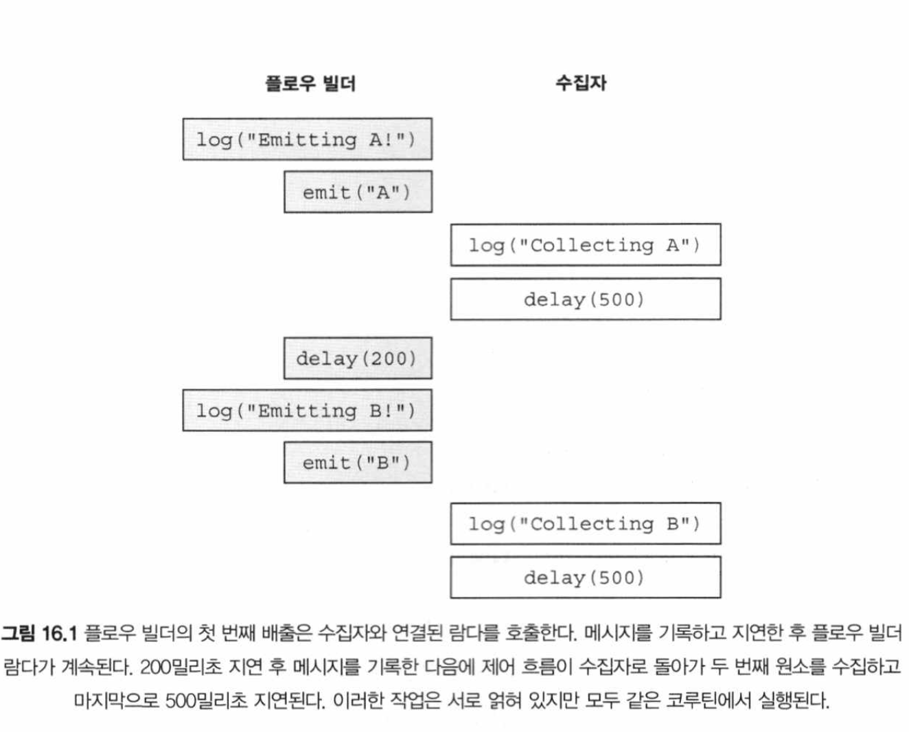
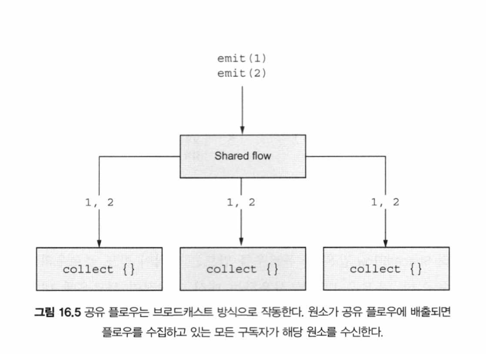
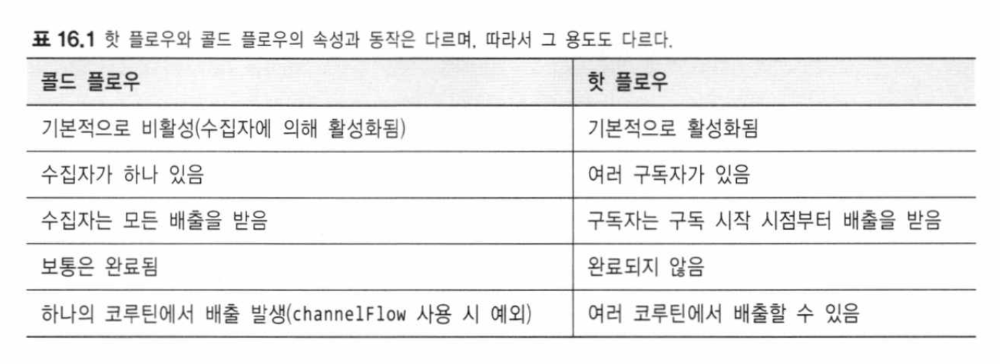

# 16장 - (p.683 - 717)

- 플로우 (Flow) 를 사용하면 시간이 지남에 따라 나타나는 여러 값을 다루는 상황에서 코틀린의 동시성 매커니즘을 사용할 수 있음

- 여러 값을 시간이 지남에 따라 계산하는 상황에서 함수가 실행을 마칠 때까지 기다리지 않고 값을 사용할 수 있도록 비동기적으로 반환하고 싶을 때 플로우가 유용하게 사용될 수 있음
- 플로우는 반응형 스트림에서 영향을 받음

## 플로우를 사용하면 배출되자마자 원소를 처리할 수 있음

```kotlin
import kotlinx.coroutines.delay
import kotlinx.coroutines.runBiocking
import kotlinx.coroutines .flow.*
import kotlin.time.Duration.Companion.milliseconds

fun createValues(): Flow<Int> {
	return flow {
		emit(1)
		delay(1000.milliseconds)
		emit(2)
		delay(1000.milliseconds)
		emit(3)
		delay(1000.milliseconds)
	}
}

fun main() = runBiocking {
	val myFlowOfValues = createValues ()
	myFLowOfValues.collect { log(it) }
}
```

## 코틀린 플로우의 여러 유형

- 코틀린의 모든 플로우는 시간이 지남에 따라 등장하는 값과 작업할 수 있는 일관된 API를 제공하지만 콜드 플로우와 핫 플로우라는 2가지 카테고리로 나뉨
- 콜드 플로우: 비동기 데이터 스트림. 값이 실제로 소비되기 시작할 때만 값을 배출
- 핫 플로우: 브로드캐스트 방식으로 동작. 값이 실제로 소비되고 있는지와 상관없이 값을 독립적으로 배출

## 콜드 플로우

- `flow` 빌더 함수를 사용
  - `emit` 함수로 플로우의 수집자에게 값을 제공
    - 수집자가 해당 값을 처리할 때 까지 빌더 함수의 실행을 중단
    - 비동기 `return` 처럼 생각할 수 있음
  - `flow` 가 받는 블록은 `suspend` 변경자가 붙어 있으므로 빌더 내부에서 delay 와 같은 다른 일시 중단 함수를 호출 가

### 콜드 플로우는 수집되기 전까지 작업을 수행하지 않음

- Flow 에 대해 collect 함수를 호출하면 그 로직이 실행됨
- 수집자 (collect): 플로우를 수집하는 코드
- 플로우를 수집할 때는 플로우 내부의 일시 중단 코드를 실행
  - 그러므로 collect 는 일시 중단 함수
  - 플로우가 끝날 때 까지 일시 중단됨
  - 수집자에게 제공된 람다도 일시 중단될 수 있기 때문에, 다른 일시 중단 함수를 호출할 수 있음
    - 예) DB 접근, HTTP 요청

```kotlin
import kotlinx.coroutines.*
import kotlinx.coroutines.flow.*
import kotlin.time.Duration.Companion.milliseconds

val letters = flow {
	log("Emitting A!")
	emit("A")
	delay(200.milliseconds)
	log("Emitting B!")
	emit("B")
}

fun main() = runBlocking {
	letters.collect {
		log("Collecting $it")
		delay(500.milliseconds)
	}
}
```



### 플로우 수집 취소

- 수집자의 코루틴을 취소하면 다음 취소 지점에서 플로우 수집이 중단됨

### 콜드 플로우의 내부 구현

- 코틀린의 콜드 플로우는 일시 중단 함수와 수신 객체 지정 람다를 결합한 조합

### 채널 플로우

- 콜드 플로우의 특별한 유형
  - 순차적으로 배출하는 `emit` 함수를 제공하지 않음
  - 대신 여러 코루틴에서 `send` 를 사용해 값을 제공할 수 있음
  - 플로우 수집자는 여전히 값을 순차적으로 수신하고, `collect` 람다가 그 작업을 수행

### 핫 플로우

- 핫 플로우에서는 각 수집자가 플로우 로직 실행을 독립적으로 촉발하는 대신, 여러 구독자 (subscriber) 라고 불리는 수집자들이 배출된 항목을 공유
- 이는 시스템에서 이벤트나 상태 변경이 발생해서 수집자가 존재하는지 여부에 상관없이 값을 배출하는 경우에 적합

- 공유 플로우: 값을 브로드캐스트하기 위해 사용됨
- 상태 플로우: 상태를 전달하는 특별한 경우에 사용됨

### 공유 플로우는 값을 구독자에게 브로드캐스트한다

- 공유 플로우는 구독자가 존재하는지 여부에 상관없이 배출이 발생하는 브로드캐스트 방식으로 작동



- 구독자는 collect 로 수집 가능
- 배출이 발생할 때 마다 제공한 람다가 실행됨
- 그러나 구독자는 수독 시작 이후에 배출된 값만 수신함

### 구독자를 위한 값 재생

- 공유 플로우 구독자는 구독을 시작한 이후에 배출된 값만 수신
- 구독자가 구독 이전에 배출된 원소도 수신하기를 원한다면 `MutableSharedFlow` 를 생성할 때 `replay` 파라미터를 사용해 새 구독자를 위해 제공할 값의 캐시를 설정할 수 있음

### sharedIn 으로 콜드 플로우를 공유 플로우로 전환

- 주어진 콜드 플로우를 한 플로우인 공유 플로우로 변환할 수 있음

### 시스템 상태 추적: 상태 플로우

- 변수의 상태 변화를 쉽게 추적할 수 있는 공유 플로우의 특별한 버전
- 상태 플로우는 원자적으로 값을 갱신할 수 있는 update 함수를 제공
  - 이 함수는 이전 값을 기반으로 새 값을 어떻게 계산해야 하는지 정하는 람다 표현식을 인자로 받음

### 상태 플로우는 값이 실제로 달라졌을 때만 값을 배출: 동등성 기반 통합

### 상태 플로우와 공유 플로우의 비교



# 요약

- 코틀린 플로우는 시간이 지남에 따라 발생하는 값을 처리할 수 있는 코루틴
  기반의 추상화
- 플로우에는 핫 플로우와 콜드 플로우라는 2가지 유형이 있음
- 콜드 플로우는 기본적으로 비활성 상태이며, 하나의 수집자와 연결된다
- flow 빌더 함수로 콜드 플로우를 생성하며, emit 함수로 비동기적으로 값올
  제공함
- 채널 플로우는 콜드 플로우의 특수 유형으로, 여러 코루틴에서 send 함수를
  통해 값을 배출할 수 있음
- 핫 플로우는 항상 활성 상태이며, 여러 구독자와 연결됨
- 공유 플로우와상태 플로우는 핫 플로우의 예
- 코루틴 간에 값을 브로드캐스트 방식으로 전달하는 데 공유 플로우를 사용
  할 수 있음
- 공유 플로우의 구독자는 구독을 시작한 시점부터 배출된 값을 받으며, 재생
  된 값도 수신할 수 있음
- 동시성 시스템에서 상태를 관리할 때 상태 플로우를 사용할 수 있음
- 상태 플로우는 동등성 기반 통합을 수행
  - 이는 값이 실제로 변경된 경우에만 배출이 발생하고, 같은 값이 여러 번 대입되면 배출이 발생하지 않는
    다는 뜻
- `shareln`이나 `stateln` 함수를 통해 콜트 플로우를 핫 플로우로 전환할 수
  있음
